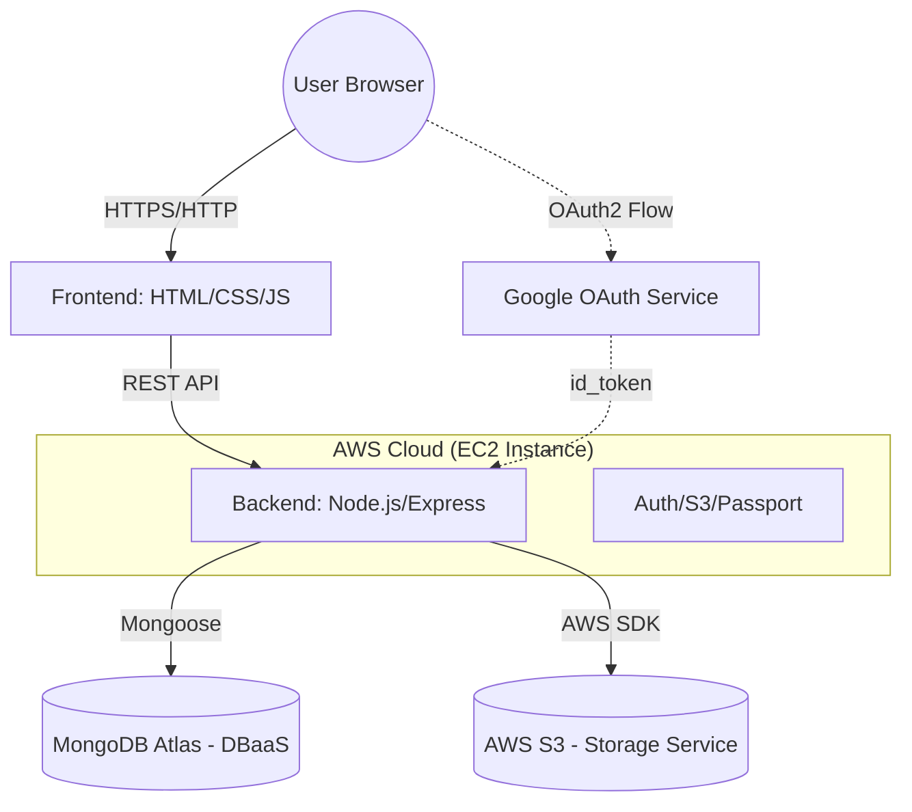

# System Architecture

## 1. High-Level 3-Tier Architecture

The Smart Attendance System follows a classic 3-tier cloud architecture, ensuring separation of concerns and scalability.

## 2. Component Breakdown

### 2.1 Presentation Tier (Frontend)
- **Technology**: Vanilla HTML5, CSS3, JavaScript (ES6).
- **Function**: Responsibly renders the dashboard, handles user interactions, and communicates with the Backend API via `fetch`.
- **Hosting**: Served as static files by the Node.js server on EC2.

### 2.2 Logic Tier (Backend)
- **Technology**: Node.js, Express.js.
- **Middleware**: 
  - `jsonwebtoken` for stateless auth.
  - `passport` for Google Social Login.
  - `multer` + `multer-s3` for handling file uploads.
- **Hosting**: AWS EC2 (Ubuntu Linux). Managed by **PM2** for high availability.

### 2.3 Data Tier (Storage)
- **Primary Database**: MongoDB Atlas (Managed DBaaS). Stores user profiles and attendance logs.
- **File Storage**: AWS S3 (Storage Service). Stores user profile pictures and static assets.

## 3. Security Controls

- **Authentication**: Dual-path (Local JWT + Google OAuth2).
- **Authorization**: Role-based access control (Student vs Admin).
- **External Security**: 
  - AWS Security Groups (Virtual Firewall) restricting ports (22, 80, 443, 5000).
  - IAM Roles for EC2-to-S3 secure access.
- **Data Integrity**: Bcrypt password hashing and JWT signing.
